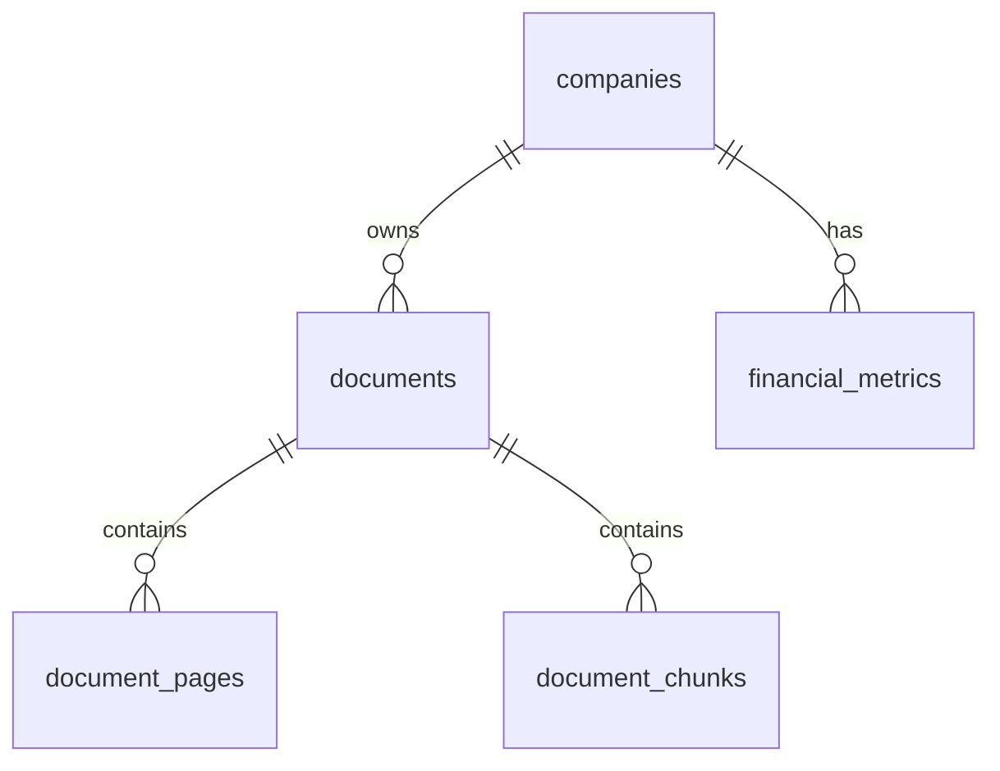

# Action Items - Code Review 2026-04-18

**Created:** 2026-04-18  
**Priority:** High  
**Review Date:** 2026-05-18

---

## 🔴 High Priority (Complete by 2026-04-25)

### 1. Fix Stage Numbering Inconsistency

**Status:** ⏳ Pending  
**Effort:** 30 minutes  
**Files:** `nanobot/ingestion/stages/stage4_agentic_extractor.py`

**Task:**
```bash
# Search and replace in stage4_agentic_extractor.py
# Replace "Stage 5" with "Stage 4" in log messages
```

**Specific Changes:**
- Line 127: `logger.info(f"🎯 Stage 5: Agentic 写入...")` → `logger.info(f"🎯 Stage 4: Agentic 写入...")`
- Check for other occurrences

**Testing:**
- Run pipeline and verify log output shows correct stage numbers

---

### 2. Fix COLUMN_MAPPINGS Accuracy

**Status:** ⏳ Pending  
**Effort:** 15 minutes  
**Files:** `vanna-service/vanna_training.py`

**Task:**
```python
# Line 17: Remove misleading mapping
COLUMN_MAPPINGS = {
    'market_data': { ... },
    'revenue_breakdown': { ... },
    'key_personnel': { ... },
    'document_pages': {
        # REMOVE THIS LINE:
        # 'doc_id': 'document_id',  # 需 JOIN documents
        
        # Keep this:
        'company_id': None  # 已删除，需 JOIN documents
    },
    ...
}
```

**Testing:**
- Verify Vanna training still works
- Check SQL generation for document_pages queries

---

### 3. Add Parameter Validation

**Status:** ⏳ Pending  
**Effort:** 45 minutes  
**Files:** 
- `nanobot/ingestion/stages/stage1_parser.py`
- `nanobot/ingestion/stages/stage0_preprocessor.py`
- Other stage files with enum parameters

**Task for stage1_parser.py:**
```python
async def parse_pdf(
    pdf_path: str,
    output_dir: str = None,
    doc_id: str = None,
    tier: str = "agentic",
    save_result: bool = True,
    skip_if_saved: bool = True
) -> Dict[str, Any]:
    """
    Parse PDF and return artifacts
    
    Args:
        pdf_path: PDF file path
        output_dir: Output directory (default: data/raw/llamaparse/{pdf_filename})
        doc_id: Document ID (optional)
        tier: LlamaParse parsing tier (agentic/cost_effective/fast)
        save_result: Whether to auto-save results
        skip_if_saved: Skip parsing if already saved
        
    Raises:
        ValueError: If tier is not valid
        FileNotFoundError: If PDF file does not exist
    """
    # Add validation at function start
    valid_tiers = ["agentic", "cost_effective", "fast"]
    if tier not in valid_tiers:
        raise ValueError(f"Invalid tier: {tier}. Must be one of {valid_tiers}")
    
    # ... rest of function
```

**Testing:**
```python
# Test invalid tier
try:
    await parser.parse_pdf("test.pdf", tier="invalid")
except ValueError as e:
    print(f"✅ Validation works: {e}")
```

---

### 4. Standardize Comment Language (Phase 1)

**Status:** ⏳ Pending  
**Effort:** 2 hours  
**Files:** All Python files in `nanobot/ingestion/`

**Task:**
1. Convert all code comments to English
2. Keep user-facing strings in Chinese
3. Update docstrings to English

**Example:**
```python
# ❌ Before
# 🌟 v4.3: Vision 必须成功，不使用 Filename Fallback

# ✅ After
# v4.3: Vision must succeed, no filename fallback
```

**Scope:**
- Start with stage files (stage0-8)
- Then pipeline files
- Then utils/helpers

**Testing:**
- Code review to ensure no mixed languages
- Verify user-facing messages remain in Chinese

---

## 🟡 Medium Priority (Complete by 2026-05-18)

### 5. Add TODO Comments for Technical Debt

**Status:** ⏳ Pending  
**Effort:** 1 hour  
**Files:** Throughout codebase

**Task:**
Review `REFACTOR_PLAN.md` and `REFACTOR_STATUS.md`, add TODO comments in code:

```python
# TODO: Migrate DocumentPipeline to inherit from BaseIngestionPipeline
# See: nanobot/ingestion/REFACTOR_PLAN.md
# Priority: High
# Estimated effort: 2 days

# TODO(v2.4): Remove legacy support for old schema
# Timeline: Q3 2026
```

**Locations:**
- `pipeline.py` - Migration to BaseIngestionPipeline
- `stage4_agentic_extractor.py` - Tool registry improvements
- `vanna_training.py` - Additional SQL examples

---

### 6. Update Outdated Version References

**Status:** ⏳ Pending  
**Effort:** 30 minutes  
**Files:** 
- `nanobot/ingestion/pipeline.py`
- Other files with version numbers

**Task:**
```python
# ❌ Before
"""
Document Pipeline - 主流程协调器 (v4.0 极简版)
行数对比：
- v3.2 (臃肿版): 1647 行
- v4.0 (极简版): ~130 行 🎉
"""

# ✅ After (Option 1: Update numbers)
"""
Document Pipeline - Main workflow coordinator (v4.0)
Current lines: 249 (as of 2026-04-18)
"""

# OR (Option 2: Remove specific numbers)
"""
Document Pipeline - Main workflow coordinator
Minimalist orchestrator pattern
"""
```

---

### 7. Create API Documentation

**Status:** ⏳ Pending  
**Effort:** 4 hours  
**Files:** New file `docs/API_REFERENCE.md`

**Task:**
Document Vanna API endpoints with examples:

```markdown
# Vanna API Reference

## POST /api/ask

Ask Vanna a natural language question.

### Request
```json
{
  "question": "CK Hutchison 2023 年收入是多少？",
  "include_sql": true,
  "include_summary": false
}
```

### Response
```json
{
  "question": "CK Hutchison 2023 年收入是多少？",
  "sql": "SELECT standardized_value FROM financial_metrics WHERE...",
  "data": [{"standardized_value": 3456.78}],
  "status": "ready"
}
```

### Error Codes
- 400: Invalid question format
- 503: Vanna not initialized
```

---

### 8. Generate Schema ERD

**Status:** ⏳ Pending  
**Effort:** 2 hours  
**Files:** New file `docs/schema_erd.md` or visual diagram

**Task:**
Create Entity Relationship Diagram from `storage/init_complete.sql`

**Tools:**
- [dbdiagram.io](https://dbdiagram.io/) (free)
- [Mermaid.js](https://mermaid.js.org/) (markdown-native)

**Example (Mermaid):**


---

## 🟢 Low Priority (Complete by 2026-06-18)

### 9. Reduce Emoji Usage

**Status:** ⏳ Pending  
**Effort:** 1 hour  
**Files:** All Python files

**Guidelines:**
- Use emojis for major section markers only: `# ===== Section =====`
- Remove from inline comments
- Keep in user-facing logs (optional)

**Before:**
```python
# 🌟 Step 1: Check PyMuPDF
# 🚀 Step 2: Parse PDF
# 💾 Step 3: Save Results
```

**After:**
```python
# ===== Step 1: Check PyMuPDF =====
# ===== Step 2: Parse PDF =====
# ===== Step 3: Save Results =====
```

---

### 10. Create CHANGELOG.md

**Status:** ⏳ Pending  
**Effort:** 1 hour  
**Files:** New file `CHANGELOG.md`

**Template:**
```markdown
# Changelog

## [v2.3.0] - 2026-04-18

### Added
- Dual-track industry classification system
- JSONB dynamic attributes for documents and companies
- Vanna training with enhanced DDL and documentation

### Changed
- Field name changes in market_data, revenue_breakdown, key_personnel
- document_pages no longer has company_id (must JOIN documents)

### Fixed
- Stage numbering consistency (Stage 4 vs Stage 5)
- COLUMN_MAPPINGS accuracy

### Deprecated
- Old field names: trade_date → data_date, closing_price → close_price

## [v2.2.0] - 2026-03-01
...
```

---

## Tracking

### Weekly Check-ins

**Week 1 (2026-04-25):**
- [ ] Item 1: Stage numbering ✅ / ⏳ / ❌
- [ ] Item 2: COLUMN_MAPPINGS ✅ / ⏳ / ❌
- [ ] Item 3: Parameter validation ✅ / ⏳ / ❌

**Week 2 (2026-05-02):**
- [ ] Item 4: Comment language (50% complete)
- [ ] Item 5: TODO comments
- [ ] Item 6: Version references

**Week 3 (2026-05-09):**
- [ ] Item 7: API documentation
- [ ] Item 8: Schema ERD
- [ ] Continue Item 4: Comment language (100% complete)

**Week 4 (2026-05-16):**
- [ ] Review all high priority items
- [ ] Start medium priority items
- [ ] Plan next month's priorities

---

## Notes

### Dependencies

- Item 1 (Stage numbering) must be done before testing pipeline
- Item 2 (COLUMN_MAPPINGS) affects Vanna training accuracy
- Item 3 (Parameter validation) prevents runtime errors

### Blockers

None identified.

### Additional Resources

- [Comment Style Guide](docs/COMMENT_STYLE_GUIDE.md)
- [Code Review Report](docs/CODE_REVIEW_2026-04-18.md)
- [Review Summary (Chinese)](docs/REVIEW_SUMMARY_ZH.md)

---

**Last Updated:** 2026-04-18  
**Next Review:** 2026-04-25  
**Owner:** Development Team
